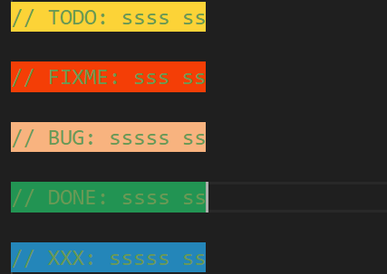

# What

1. After you finish launching VSCode, a greeting will pop up. You can customize it in the settings.

2. We have registered the command **"File Information"** in the context menu, which you can click on to view the current file or folder size, creation time, modification time, and file path.

3. You can quickly run an exe file by clicking Run Executable in the right-click menu.

4. Support for highlighting specific annotations. Currently only C, CPP, JAVASCRIPT, TYPESCRIPT, JAVA files are supported.

5. More features are still in development, so stay tuned~

# More

1. You can open Settings and search for **"Hello Config"** to modify the default settings.

2. If the settings don't meet your needs, you can customize the greeting by reading the **"include"** folder.You can find this file in the VSCode plugin directory. On my computer this path is C:/Users/86157/.vscode/extensions/lovescript.not-noly-hello-0.1.0/include/.

3. The method used to run the executable is to enter commands into the terminal through VSCode's API.

4. You can find the command "打开hello .txt" in the command bar, where you can edit random greetings, each line represents a greeting, and no blank lines appear.
